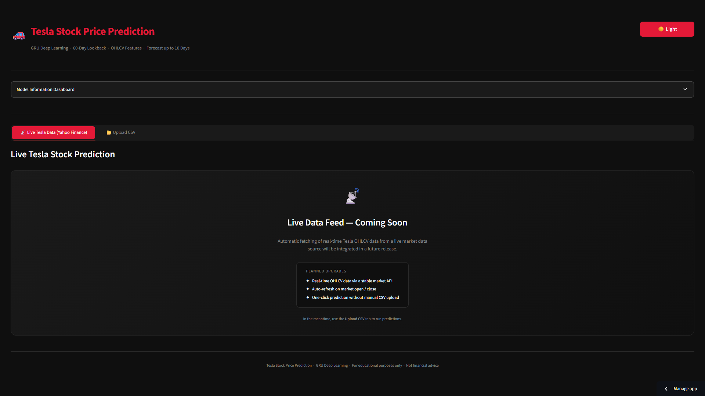
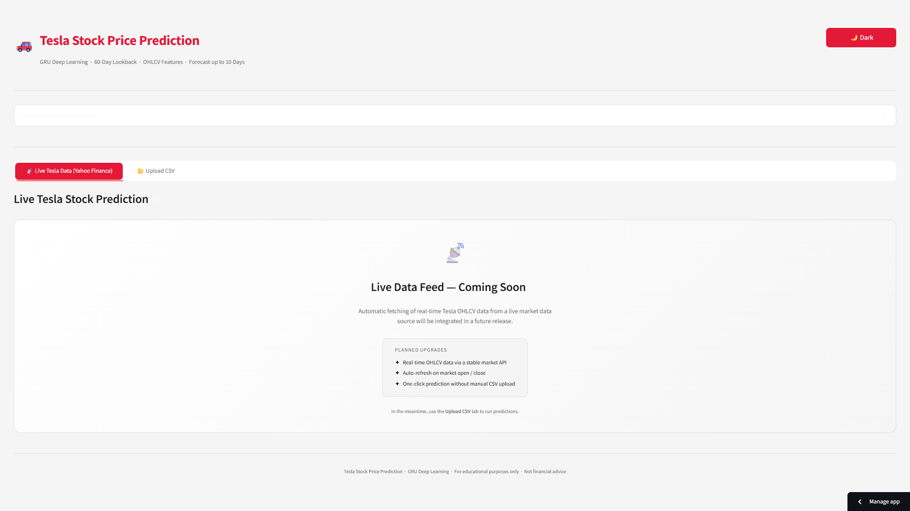
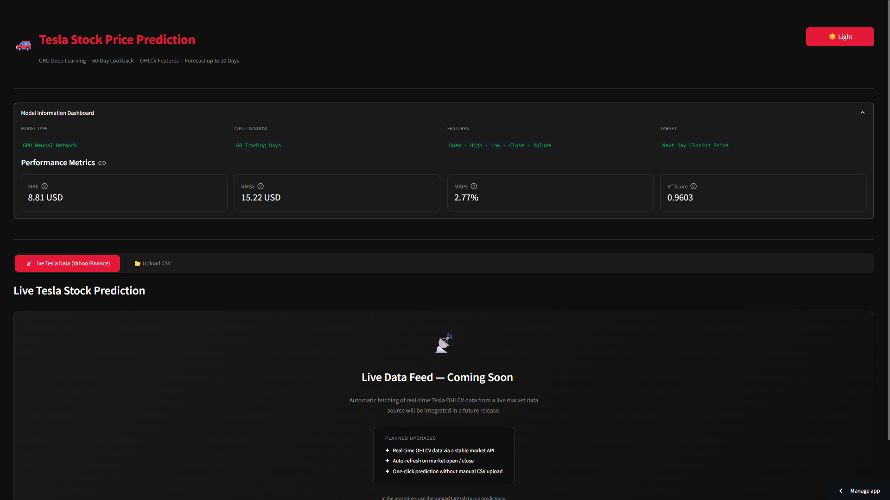
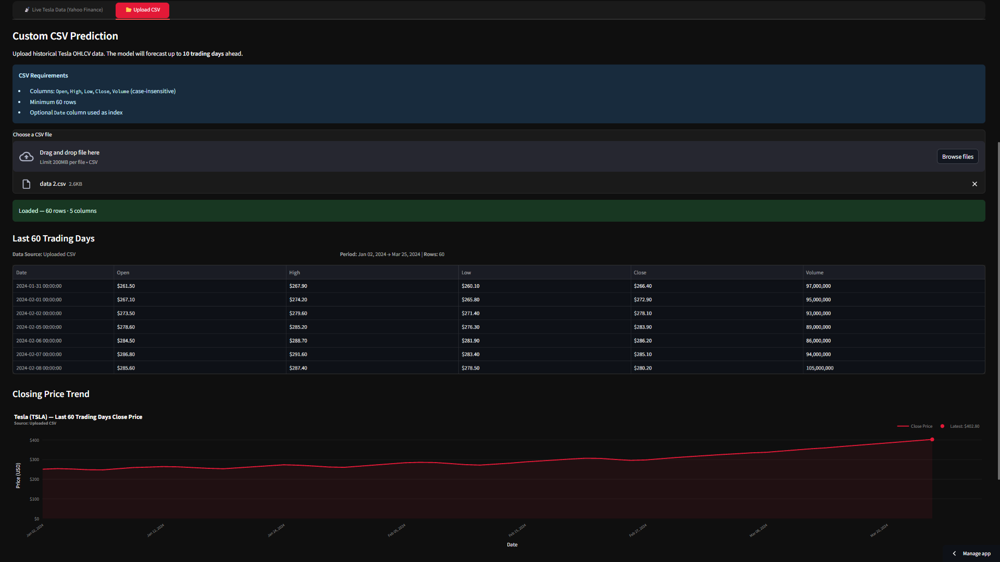
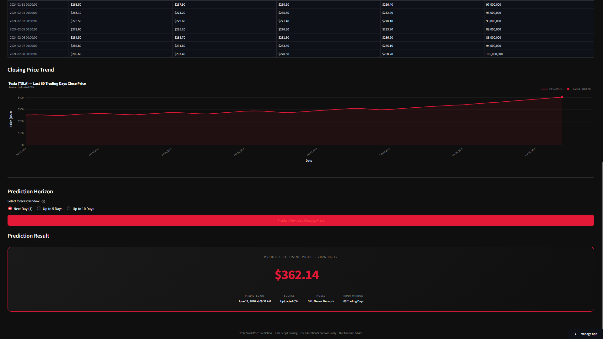
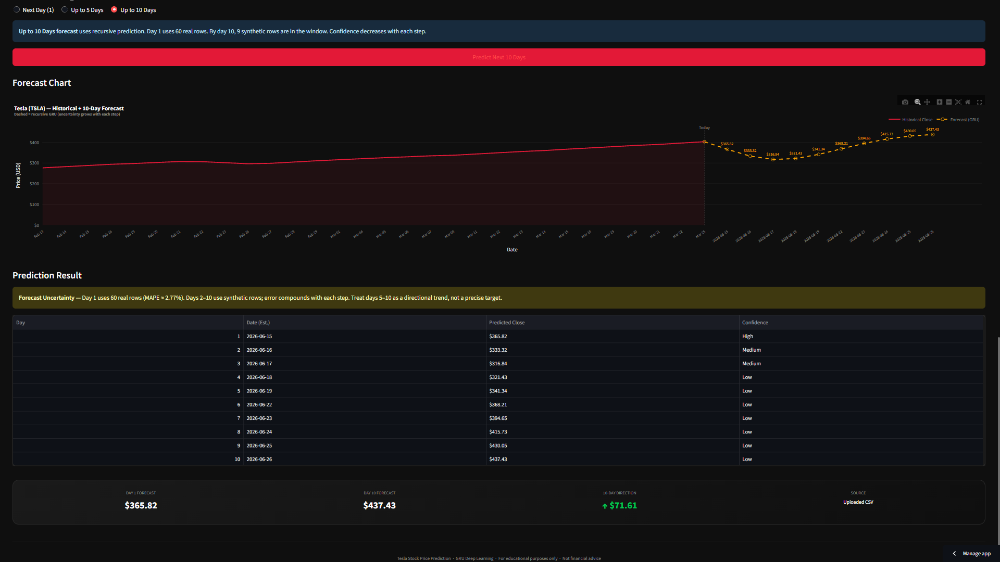

# 🚗 Tesla Stock Price Prediction

> A production-quality Streamlit web application that forecasts Tesla's (TSLA) next **1, 5, or 10 trading days** closing price using a trained **GRU (Gated Recurrent Unit)** deep learning model.


---

<!--
  ┌─────────────────────────────────────────────────────────────────┐
  │  SCREENSHOT 1 — APP OVERVIEW (Dark Theme)                       │
  │  What to capture: Full app in dark mode showing the header,     │
  │  model info dashboard, and both tabs visible.                   │
  │  Suggested filename: screenshots/app-dark.png                   │
  └─────────────────────────────────────────────────────────────────┘
-->
<!-- Add screenshot below this line -->


---

## 📋 Table of Contents

- [Features](#-features)
- [Screenshots](#-screenshots)
- [Model Performance](#-model-performance)
- [Project Structure](#-project-structure)
- [Setup & Installation](#-setup--installation)
- [How to Use](#-how-to-use)
- [CSV Format](#-csv-format)
- [Architecture](#-architecture)
- [Deployment](#-deployment-streamlit-cloud)
- [Tech Stack](#-tech-stack)
- [Disclaimer](#-disclaimer)

---

## ✨ Features

- 📂 **CSV Upload** — upload your own historical OHLCV data for prediction
- 📈 **Multi-step Forecasting** — predict next **1, 5, or 10 trading days**
- 🔁 **Recursive GRU Forecasting** — momentum-corrected to prevent mean-reversion drift
- 🌗 **Dark / Light Theme Toggle** — switch themes with one click
- 📊 **Interactive Plotly Charts** — hover, zoom, and pan on all charts
- 🧠 **Model Dashboard** — live display of MAE, RMSE, MAPE, R² metrics
- ⚠️ **Confidence Labels** — High / Medium / Low per forecast day
- 🔒 **No data leakage** — scaler fitted on training data only, never on deployment data

---

## 📸 Screenshots

### Dark Theme — App Overview

<!--
  ┌─────────────────────────────────────────────────────────────────┐
  │  SCREENSHOT 1 — DARK THEME OVERVIEW                             │
  │  Capture: Full page scroll showing header + model dashboard     │
  │  Filename: screenshots/app-dark.png                             │
  └─────────────────────────────────────────────────────────────────┘
-->


---

### Light Theme — App Overview

<!--
  ┌─────────────────────────────────────────────────────────────────┐
  │  SCREENSHOT 2 — LIGHT THEME OVERVIEW                            │
  │  Capture: Click "☀️ Light" toggle, take full page screenshot   │
  │  Filename: screenshots/app-light.png                            │
  └─────────────────────────────────────────────────────────────────┘
-->


---

### Model Information Dashboard

<!--
  ┌─────────────────────────────────────────────────────────────────┐
  │  SCREENSHOT 3 — MODEL DASHBOARD                                 │
  │  Capture: Expand the "Model Information Dashboard" section      │
  │  showing all 4 metric cards (MAE, RMSE, MAPE, R²)              │
  │  Filename: screenshots/model-dashboard.png                      │
  └─────────────────────────────────────────────────────────────────┘
-->


---

### CSV Upload & Data Preview

<!--
  ┌─────────────────────────────────────────────────────────────────┐
  │  SCREENSHOT 4 — CSV UPLOAD TAB                                  │
  │  Capture: After uploading a CSV — show the data preview table   │
  │  and the closing price trend chart below it                     │
  │  Filename: screenshots/csv-upload.png                           │
  └─────────────────────────────────────────────────────────────────┘
-->


---

### Single-Day Prediction Result

<!--
  ┌─────────────────────────────────────────────────────────────────┐
  │  SCREENSHOT 5 — NEXT DAY PREDICTION CARD                        │
  │  Capture: Select "Next Day (1)" horizon, click Predict,         │
  │  screenshot the large price card output                         │
  │  Filename: screenshots/prediction-1day.png                      │
  └─────────────────────────────────────────────────────────────────┘
-->


---

### Multi-Day Forecast (5 or 10 Days)

<!--
  ┌─────────────────────────────────────────────────────────────────┐
  │  SCREENSHOT 6 — MULTI-STEP FORECAST                             │
  │  Capture: Select "Up to 5 Days" or "Up to 10 Days",            │
  │  click Predict — show the forecast chart (dashed orange line)   │
  │  + the forecast table with confidence labels below it           │
  │  Filename: screenshots/forecast-multiday.png                    │
  └─────────────────────────────────────────────────────────────────┘
-->


---

## 📊 Model Performance

The GRU model was trained on historical Tesla OHLCV data using a **60-day lookback window**.

| Metric | Value | Description |
|--------|-------|-------------|
| **MAE** | 8.81 USD | Average prediction error in USD |
| **RMSE** | 15.22 USD | Root mean squared error |
| **MAPE** | 2.77% | Mean absolute percentage error |
| **R²** | 0.9603 | Coefficient of determination (1.0 = perfect) |

> ⚠️ **Multi-step accuracy note:** The MAPE of 2.77% applies to **day-1 only**.
> Days 2–10 use recursive forecasting with synthetic rows — error compounds with each step.
> Days 5–10 should be read as a **directional trend**, not a precise price target.

---

## 📁 Project Structure

```
Tesla-Stock-Prediction/
│
├── app.py                      # Streamlit entry point — UI orchestration only
│
├── model/
│   ├── tesla_gru_model.keras   # Trained GRU model (not committed — see .gitignore)
│   └── tesla_scaler.pkl        # Fitted MinMaxScaler (not committed)
│
├── utils/
│   ├── config.py               # All constants and hyperparameters (single source of truth)
│   ├── data_loader.py          # CSV ingestion, validation, window extraction
│   ├── preprocessing.py        # Scaling, reshaping (1,60,5), inverse transform
│   ├── predictor.py            # Model loading, single-step & multi-step inference
│   └── visualizer.py           # Plotly charts, metric cards, theme-aware components
│
├── screenshots/                # App screenshots for this README
├── assets/                     # Static files
├── requirements.txt
├── .gitignore
└── README.md
```

---

## ⚙️ Setup & Installation

### Prerequisites
- Python 3.10 or higher
- `pip` package manager

### 1. Clone the repository
```bash
git clone https://github.com/your-username/Tesla-Stock-Prediction.git
cd Tesla-Stock-Prediction
```

### 2. Create a virtual environment
```bash
# Create
python -m venv venv

# Activate
source venv/bin/activate        # macOS / Linux
venv\Scripts\activate           # Windows
```

### 3. Install dependencies
```bash
pip install -r requirements.txt
```

### 4. Add model files
The trained model and scaler are **not committed** to the repository (binary files — see `.gitignore`).
Place them manually inside the `model/` directory:

```
model/
├── tesla_gru_model.keras
└── tesla_scaler.pkl
```

### 5. Run the app
```bash
streamlit run app.py
```

The app will open automatically at `http://localhost:8501`.

---

## 🖥️ How to Use

1. **Open the app** — run `streamlit run app.py`
2. **Upload CSV** — click the **Upload CSV** tab and upload your TSLA historical data
3. **Review the data** — check the table preview and 60-day trend chart
4. **Select horizon** — choose **Next Day (1)**, **Up to 5 Days**, or **Up to 10 Days**
5. **Predict** — click the Predict button
6. **Read results** — single-day shows a price card; multi-day shows a forecast chart + table
7. **Toggle theme** — click **☀️ Light** / **🌙 Dark** in the top-right corner

---

## 📄 CSV Format

Your CSV must contain the following columns (case-insensitive):

| Column | Type | Example |
|--------|------|---------|
| `Date` | datetime | `2024-01-15` *(optional)* |
| `Open` | float | `248.50` |
| `High` | float | `255.30` |
| `Low` | float | `245.10` |
| `Close` | float | `252.80` |
| `Volume` | integer | `98500000` |

**Minimum rows required:** 60 (trading days)

You can download Tesla historical data from:
- [Yahoo Finance](https://finance.yahoo.com/quote/TSLA/history)
- [Nasdaq](https://www.nasdaq.com/market-activity/stocks/tsla/historical)
- [Kaggle TSLA datasets](https://www.kaggle.com/search?q=tesla+stock+OHLCV)

---

## 🧠 Architecture

### Prediction Pipeline

```
CSV Upload (≥60 rows)
        │
        ▼
  data_loader.py
  ├── validate_dataframe()     → checks columns, row count, nulls, types
  └── get_latest_window()      → tail(60), enforce column order

        │
        ▼
  preprocessing.py
  ├── load_scaler()            → loads tesla_scaler.pkl (never refit)
  └── preprocess_window()      → MinMaxScaler.transform() → reshape(1,60,5)

        │
        ▼
  predictor.py
  ├── load_model()             → loads tesla_gru_model.keras
  ├── predict()                → single-step inference → inverse_transform
  └── predict_multi_step()     → recursive n-day forecast with momentum correction

        │
        ▼
  visualizer.py
  ├── plot_closing_price()     → 60-day trend chart (theme-aware)
  ├── plot_multi_step_forecast() → historical + forecast chart
  └── render_multi_step_output() → price card or table with confidence labels
```

### Multi-Step Forecasting (Recursive)

| Step | Real rows | Synthetic rows | Confidence |
|------|-----------|----------------|------------|
| Day 1 | 60 | 0 | High |
| Day 2–3 | 58–59 | 1–2 | Medium |
| Day 4–10 | 50–56 | 4–10 | Low |

Synthetic rows are constructed from real-data statistics only (volume average, H-L range).
A **momentum-weighted blend** prevents mean-reversion drift:
- Day 1: 92% model weight
- Day 5: 60% model weight
- Day 10: 30% model weight (trend-anchored)

---

## 🚀 Deployment — Streamlit Cloud

1. Push the repo to GitHub (model files excluded via `.gitignore`)
2. Host `tesla_gru_model.keras` and `tesla_scaler.pkl` externally (Google Drive, S3, or Git LFS)
3. Add a download script or load from URL at app startup
4. Connect repo at [share.streamlit.io](https://share.streamlit.io)
5. Set entry point: `app.py`

Add to `packages.txt` for Streamlit Cloud (TensorFlow system dependency):
```
libgomp1
```

---

## 🛠️ Tech Stack

| Layer | Library | Version |
|-------|---------|---------|
| Deep Learning | TensorFlow / Keras | 2.15.0 |
| ML Utilities | scikit-learn | 1.4.2 |
| Data | pandas, NumPy | 2.2.2 / 1.26.4 |
| Web App | Streamlit | 1.35.0 |
| Charts | Plotly | 5.22.0 |
| Serialization | joblib | 1.4.2 |

---

## ⚠️ Disclaimer

This application is built for **educational and portfolio purposes only**.
Predictions are generated by a machine learning model trained on historical data
and **do not constitute financial advice**.
Past stock performance does not guarantee future results.
Do not make investment decisions based on this tool.

---

## 👤 Author

**Vivek Rupapara**
ML Engineering Intern | Building toward production-grade AI systems

---

*Built with Streamlit · GRU Deep Learning · Tesla OHLCV Data · Claude AI*
